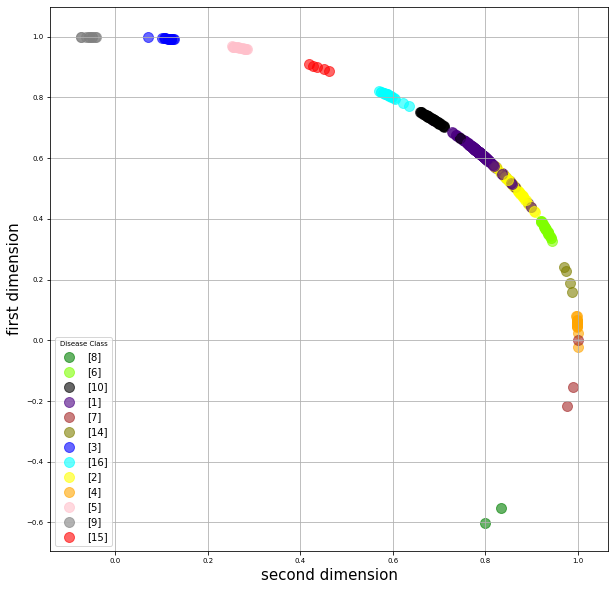

# Triple loss using arrythmia dataset

The [arrhythmia dataset](https://archive.ics.uci.edu/ml/datasets/Arrhythmia) contains Electrocardiographs of cardiac arrhythmia disease. I implement a method to find the class to which a case of arrhhythmia disease belongs to by using the triplet loss method. In this implementation, I reduce the dimensions of the dataset from 278 to 2 dimensions. Using this two dimensional representation, the method is able to classify the disease. A description of the implementation 

This code contains methods for loading the arythmia dataset. All the dataset have been grouped by classes in an array. For training, the  model requires input triplets which are Anchor,positive and negative pairs. To help the model learn the ablility to separte inputs, hard triplets are selected within the selected triplets for training. This is done by get_batch_hard(draw_batch_size,hard_batchs_size,norm_batchs_size,network,s="train") function. These hard triplets could be selected online during training but i selected them offline before training and this was done by get_dataset(draw_batch_size,hard_batchs_size,norm_batchs_size,network,steps_per_epoch) function.

The network is trained for 300 epochs. The resulting model creates embeddings maintains a small distance between similar pairs and large distance between non-similar cases of the disease. Using the distance, the method finds similar and non similar cases of the disease. 

The model created is used to test the similarity between examples from the test set. This requires two inputs and their corresponding classes. This is obtained by form_test_data(val). This inputs are fed to compute_probs(network,X,Y) function and it finds the distance between the two inputs. It is observed that the embeddings have smaller distance between similar examples and large distance between diffferent examples.

The image below show a plot of the resulting embeddings from this method.. 

This plot is the output of [plot_embeddings](plot_embeddings.py) file in this repository. To plot the embeddings on the polar grid, [plots_polar_grid](plots_polar_grid.py) can be used. Also, [Plot_mean](Plot_mean.py) is used to plot the mean of all classes in the embeddings.
